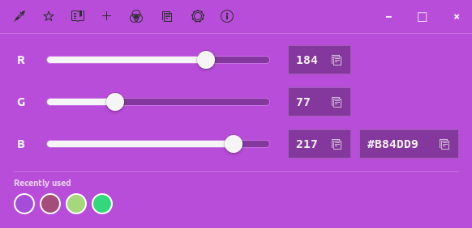

# D-Pick



A small GTK 4 / libadwaita color picker for Ubuntu.

D-Pick is built for quick color work: pick a color from the screen, fine-tune it with RGB controls, copy common CSS formats, save favorites, keep a small recent palette, and explore useful color suggestions.

## Features

- Screen color picking through the desktop portal
- Editable RGB and HEX fields
- One-click copy for HEX, RGB, RGBA, HSL, and CSS variable formats
- Favorites with copy and remove actions
- Recently used palette with configurable size
- Color suggestions drawer with complementary, analogous, pastel, tint, and shade variants
- WCAG-style contrast summary against white and black backgrounds
- Small settings drawer for palette limit, toast duration, and clearing saved data
- Native GTK/libadwaita UI with a custom app icon

## Download

The recommended way to distribute installable builds is through GitHub Releases:

https://github.com/DejanDj79/ubuntu-color-picker/releases

Each release can include a `.deb` package as a downloadable asset.

## Install From `.deb`

After downloading the package:

```bash
sudo apt install ./d-pick_0.1.0_amd64.deb
```

If you build the package locally, install it from the `dist` directory:

```bash
sudo apt install ./dist/d-pick_0.1.0_amd64.deb
```

## Build From Source

Install build dependencies:

```bash
sudo apt install build-essential pkg-config libgtk-4-dev libadwaita-1-dev
```

Build and run:

```bash
cargo run
```

Build an optimized binary:

```bash
cargo build --release
```

## Build The Debian Package

The repository includes a packaging script:

```bash
./scripts/build_deb.sh
```

The generated package is written to:

```text
dist/d-pick_0.1.0_amd64.deb
```

The package installs:

- `/usr/bin/d-pick`
- `/usr/share/applications/com.dejandj79.DPick.desktop`
- `/usr/share/icons/hicolor/scalable/apps/picker-icon.svg`

## Data Storage

Saved colors and settings are stored in:

```text
~/.local/share/d-pick/colors.json
```

or under `$XDG_DATA_HOME` when that environment variable is set.

## Project Status

This is the first usable release of D-Pick. The current focus is a polished, compact Ubuntu desktop utility rather than a large color-management suite.
